# Documentation ilibray 

Sitem ilibiray digunakan ditujukan untuk peminjaman buku secara online di sebuah perpustakaan. Project ini merupakan tugas Uji Kompetensi Keahlian yang diselenggarakan oleh Lembaga Sertifikasi Kompetensi (LSK). Dalam ujian tersebut kami sebagai siswa di beri tugas untuk membuat sistem yang bisa menjalankan CRUD serta Authentication dan bisa menambahkan fitur sesuai kreatifitas/pengembangan masing masing.

## Fitur Fitur

- *Admin*

    - Melakukan Login
    - Menambahkan Buku
    - Memperbarui Buku
    - Menghapus Buku
    - Mengembalikan Buku
    - Menambahkan Kategori Buku
    - Memperbarui Kategori Buku
    - Mencari Buku
    - Menghapus Kategori

- *User*

    - Melakukan Login
    - Melakukan Registrasi
    - Mencari Buku
    - Meminjam Buku
    - Export PDF terkait peminjaman buku
    - Melihat Semua Buku
    - Melihat Semua Category

## Tech Stack

- HTML
- CSS
- Tailwind CSS
- PHP
- Laravel
- MySQL

## Install Project

Ikuti Instruksi Dibawah 

### Installasi
Buat Database dengan nama `laravel` atau jika ingin custom ubah file `.env.example` pada bagian `DB_DATABASE` sesuai yang anda inginkan

```
git clone https://github.com/fadhluibnu/perpustakaan_laravel.git
cd perpustakaan_laravel
composer install
npm install
ren .env.example .env
php artisan key:generate
php artisan migrate
```

### Run Project

Buka terminal, jalankan perintah

```
php artisan serve
```

Buka terminal Baru, jalankan perintah

```
npm run dev
```

## To Try

Setelah anda jalankan, Jika ingin masuk sebagai admin, gunakan email dan password berikut

```
Email : admin@gmail.com
Password : 123
```

## Screenshot

- *Admin*

    - Login

        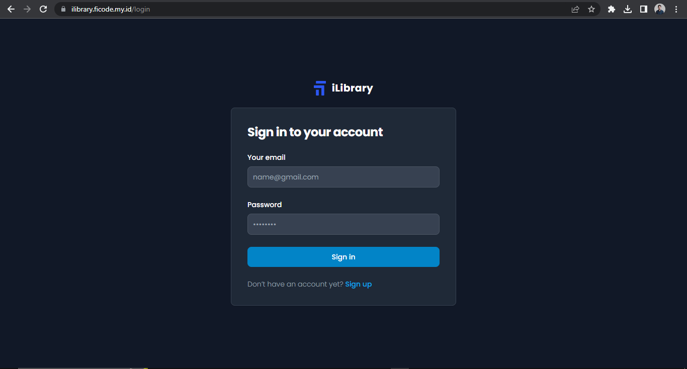

    - All Book

        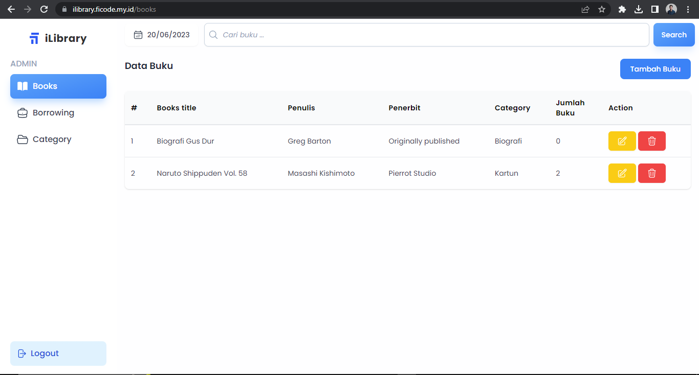

    - Add Book

        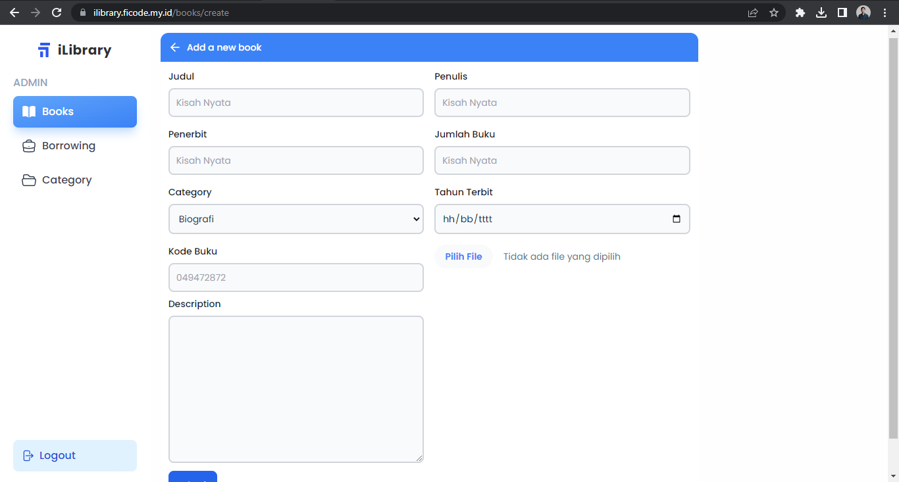

    - Edit Book

        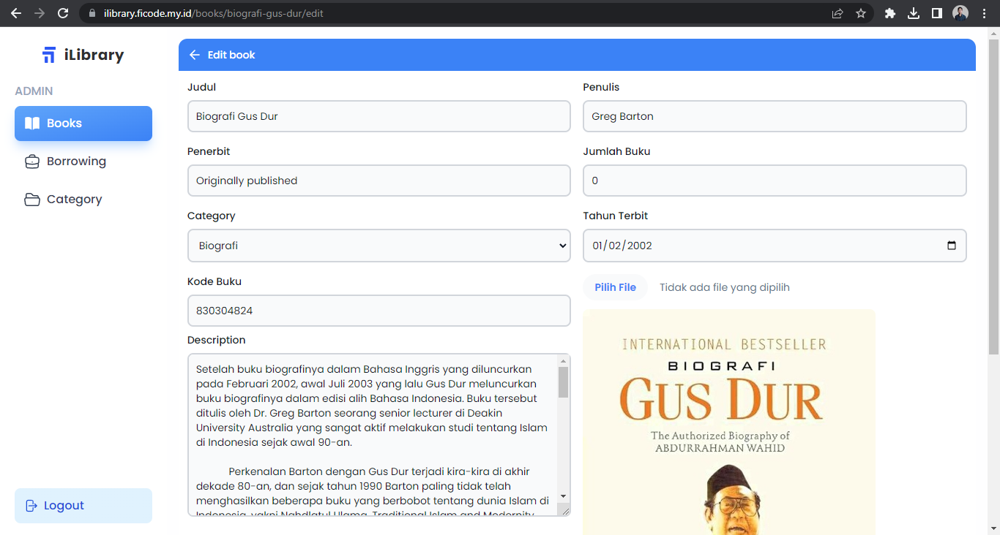

    - Book return

        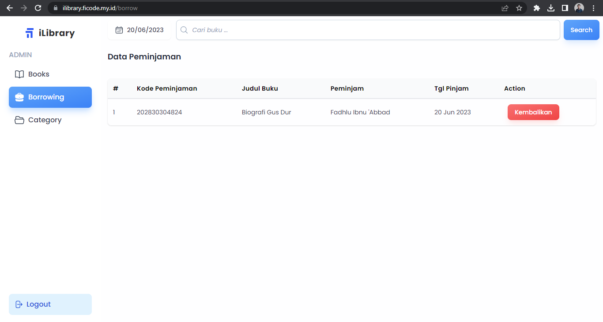

    - Category Buku

        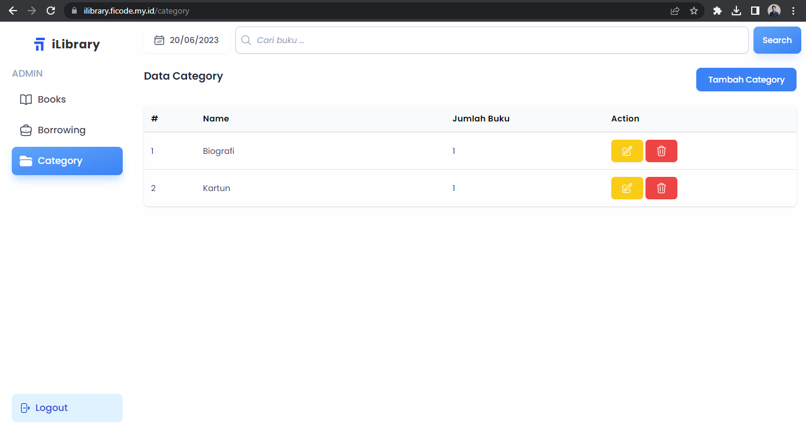

    - Create Category

        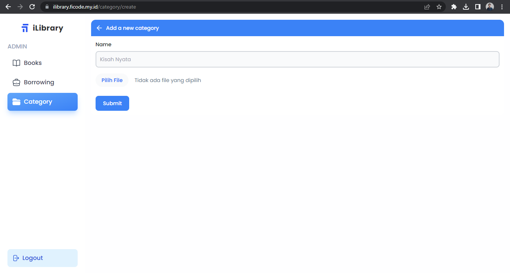

    - Edit Category

        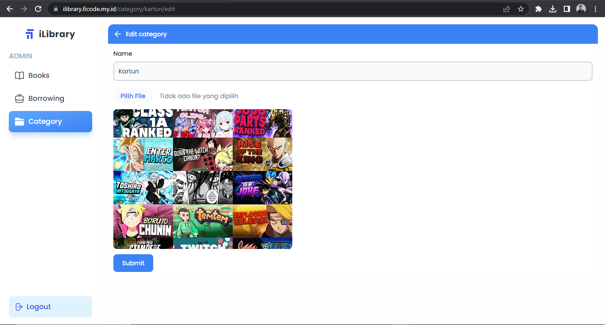

- *User*

    - Login

        

    - Registrasi

        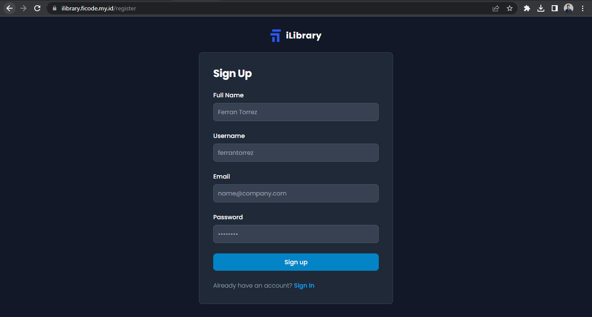

    - All Book

        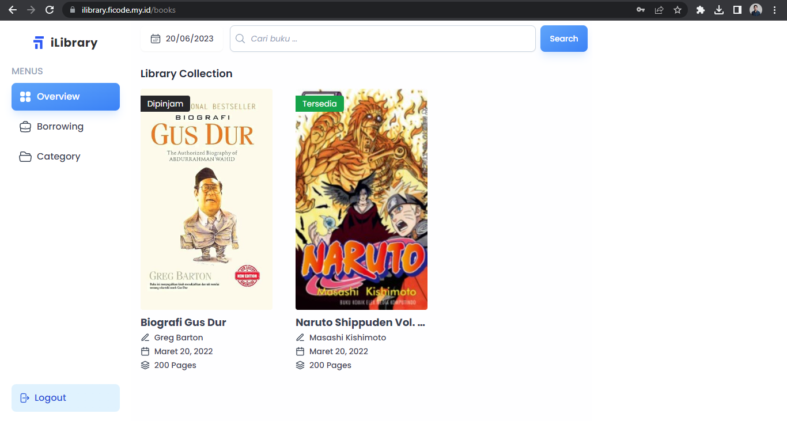

    - Book Borrowing

        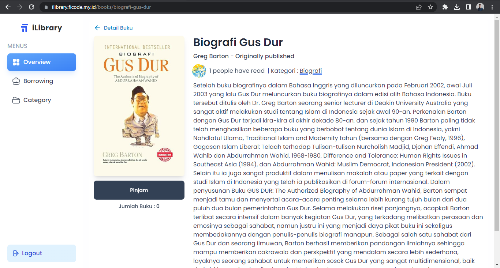


    - Borrowed Book

        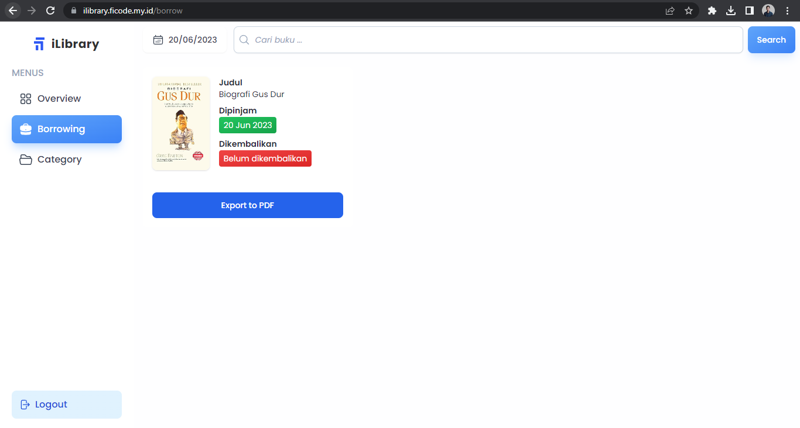


    - All Category

        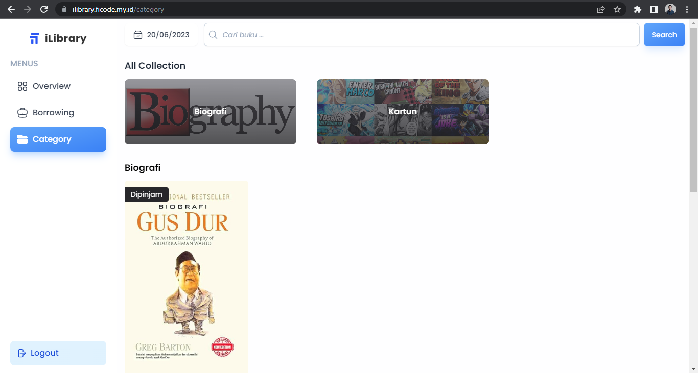

